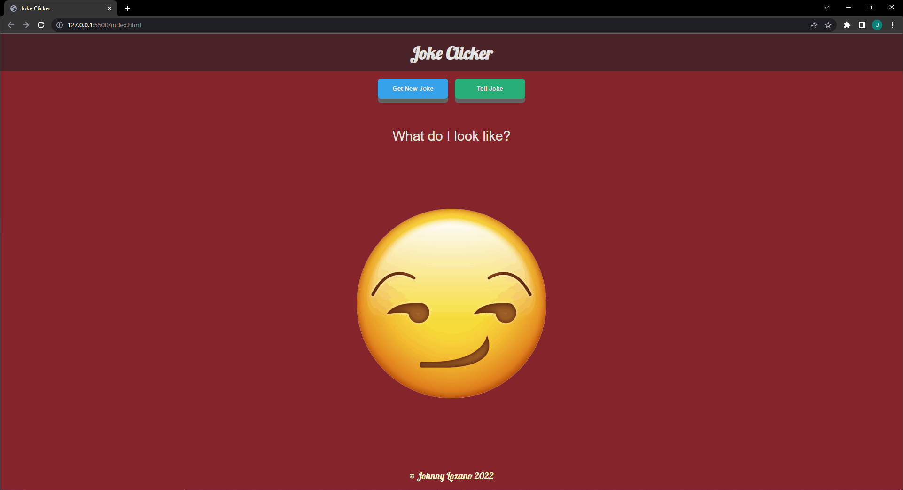

# Joke Clicker

---

## Description
This application generates jokes with the click of a button, utilizing an external API call from 15Dkatz's official_joke_api. https://github.com/15Dkatz/official_joke_api

This is a small project that I used to apply asynchronous JS concepts using async, await, and fetch API.  

---

## How to Use
The application will begin with the *setup* portion of a joke. Click the *Tell Joke* button in order to display the other half of the joke. Or the *Get New Joke* button can be pressed in order to generate a completely new joke.

---

## Special Thanks:
Official Joke API by David Katz

https://github.com/15Dkatz/official_joke_api

https://official-joke-api.appspot.com/random_joke

https://davidtkatz.com/#/about

## License
MIT License

Copyright (c) 2022 Johnny Lozano

Permission is hereby granted, free of charge, to any person obtaining a copy of this software and associated documentation files (the "Software"), to deal in the Software without restriction, including without limitation the rights to use, copy, modify, merge, publish, distribute, sublicense, and/or sell copies of the Software, and to permit persons to whom the Software is furnished to do so, subject to the following conditions:

The above copyright notice and this permission notice shall be included in all copies or substantial portions of the Software.

THE SOFTWARE IS PROVIDED "AS IS", WITHOUT WARRANTY OF ANY KIND, EXPRESS OR IMPLIED, INCLUDING BUT NOT LIMITED TO THE WARRANTIES OF MERCHANTABILITY, FITNESS FOR A PARTICULAR PURPOSE AND NONINFRINGEMENT. IN NO EVENT SHALL THE AUTHORS OR COPYRIGHT HOLDERS BE LIABLE FOR ANY CLAIM, DAMAGES OR OTHER LIABILITY, WHETHER IN AN ACTION OF CONTRACT, TORT OR OTHERWISE, ARISING FROM, OUT OF OR IN CONNECTION WITH THE SOFTWARE OR THE USE OR OTHER DEALINGS IN THE SOFTWARE.
